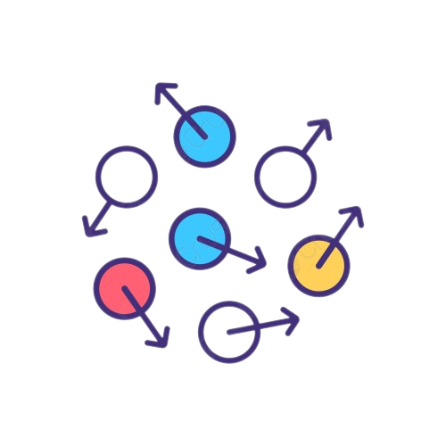

<!-- PROJECT SHIELDS -->
<!--
*** I'm using markdown "reference style" links for readability.
*** Reference links are enclosed in brackets [ ] instead of parentheses ( ).
*** See the bottom of this document for the declaration of the reference variables
*** for contributors-url, forks-url, etc. This is an optional, concise syntax you may use.
*** https://www.markdownguide.org/basic-syntax/#reference-style-links
-->
[![Contributors][contributors-shield]][contributors-url]
[![Size][size-shield]][size-url]
[![Languages][languages-shield]][languages-url]
[![Stargazers][stars-shield]][stars-url]
[![Forks][forks-shield]][forks-url]
[![MIT License][license-shield]][license-url]

 
  

<!-- LOGO -->
 

  

  <h3 align="center">Repositório de Cinética Química</h3>

  

    Bem vindo ao nosso projeto de Cinética Química, disciplina do quarto semestre da Ilum Escola de Ciência!
   
  

<!-- Sumário -->

  
Sumário

  <ol>
    <li>
      <a href="#sobre">Sobre a Disciplina</a>
      <ul>
        <li><a href="#projeto">O Projeto</a></li>
       </ul>
      <ul>
        <li><a href="#ferramentas">Ferramentas</a></li>
      </ul>
    </li>
    <li><a href="#progresso">Progresso do Projeto</a></li>
    <li>
      <a href="#isa">Sobre nós</a>
      <ul>
        <li><a href="#contato">Contatos</a></li>
      </ul>
    </li>
    <li><a href="#acknowledgments">Agradecimentos</a></li>
  </ol>

<!-- Sobre a Disciplina e o Projeto -->
## Sobre a Disciplina 

Na disciplina de Cinética Química, ministrada pelo professor Amauri de Paula, nós- alunos- fomos desafiados a desenvolver uma simulação computacional de uma reação química, focando nos modelos físico-químicos que descrevem os processos de reações químicas. Para tanto, exploraremos os seguintes tópicos:

* `Mecanismos de reação`;

* `Leis de velocidade`;

* `Energia de ativação`;

* `Ordem de reação`.
 
### O Projeto 

Teremos um problema único para desenvolver ao longo do semestre o qual reforçará o aprendizado dos modelos de reações químicas e suas aplicações. O problema central da disciplina é uma simulação computacional, que foi ser desenvolvida em 3 etapas, as quais estão definidas abaixo. O objetivo principal desta atividade é o de simular como uma reação química evolui do ponto de vista da cinética química, considerando as leis de velocidades, a distribuição estatística da velocidade das partículas e os conceitos físico-químicos envolvidos na reação.
### Ferramentas 

As ferramentas utilizadas para desenvolver o projeto dessa disciplina foram, principalmente, as plataformas Github e Jupyter Notebook, em que escrevemos os códigos usando a  linguagem Pyhton.

 
 
 

<!-- Progresso -->
## Progresso do Projeto 

- [x] Desafio 1: Modelo de Disco Rígido
- [ ] Desafio 2: Modelo Tridimensional (Esferas rígidas)
- [ ] Desafio 3: Reação Química

<!-- Sobre mim -->
## Sobre nós

Quem são os alunos por trás desse projeto de Cinética Química? Pois bem, permita-nos nos apresentar:

- 👋 Somos João Guilherme Caramês e Isabela Beneti
- 📕 Estamos no quarto semestre do Bacharelado em Ciência e Tecnologia da Ilum Escola de Ciência
- 👨‍🔬 A Ilum é uma iniciativa da instituição social CNPEM (Centro Nacional de Pesquisa em Energia e Materiais)
- 🔥 No curso, temos uma grade curricular bem interdisciplinar, que inclui a matéria de Cinética Química
- 🚗 Nosso objetivo, na disciplina, é entender melhor conceitos de cinética química e desenvolver nosso próprio modelo

<!-- CONTATO -->
### Contatos 
 

  
  
   
  
 

<!-- ACKNOWLEDGMENTS -->
## Agradecimentos 

Sem a ajuda dos professores e técnicos da Ilum, nós não teriamos conseguido chegar até onde chegamos! Por isso, agradecemos às seguintes pessoas que contribuíram para este projeto:

<table>
  <tr>
    <td align="center">
      <a href="#">
         
        
          <b>Amauri de Paula (Professor)</b>
        
      </a>
    </td>
    <td align="center">
      <a href="#">
         
        
          <b>Felipe Crasto (Professor)</b>
        
      </a>
    </td>
    <td align="center">
      <a href="#">
         
        
          <b>Alessandro Mourato (Técnico)</b>
        
      </a>
    </td>
  </tr>
</table>

 
 

<!-- MARKDOWN LINKS & IMAGES -->
<!-- https://www.markdownguide.org/basic-syntax/#reference-style-links -->
[contributors-shield]: https://img.shields.io/github/contributors/benetao/Cinetica_Quimica.svg?style=for-the-badge
[contributors-url]: https://github.com/benetao/Cinetica_Quimica/graphs/contributors
[forks-shield]: https://img.shields.io/github/forks/benetao/Cinetica_Quimica.svg?style=for-the-badge
[forks-url]: https://github.com/benetao/Cinetica_Quimica/network/members
[stars-shield]: https://img.shields.io/github/stars/benetao/Cinetica_Quimica.svg?style=for-the-badge
[stars-url]: https://github.com/benetao/Cinetica_Quimica/stargazers
[issues-shield]: https://img.shields.io/github/issues/benetao/Cinetica_Quimica.svg?style=for-the-badge
[issues-url]: https://github.com/benetao/Cinetica_Quimica/issues
[license-shield]: https://img.shields.io/github/license/benetao/Cinetica_Quimica.svg?style=for-the-badge
[license-url]: https://github.com/benetao/Cinetica_Quimica/blob/master/LICENSE.txt
[size-shield]: https://img.shields.io/github/repo-size/benetao/Cinetica_Quimica.svg?style=for-the-badge
[size-url]: https://github.com/benetao/Cinetica_Quimica/repo-size
[languages-shield]: https://img.shields.io/github/languages/count/benetao/Cinetica_Quimica.svg?style=for-the-badge
[languages-url]: https://github.com/benetao/Cinetica_Quimica//languages/count

[linkedin-shield]: https://img.shields.io/badge/-LinkedIn-black.svg?style=for-the-badge&logo=linkedin&colorB=555
[linkedin-url]: https://www.linkedin.com/in/isabela-bento-beneti-044183236/
[product-screenshot]: images/screenshot.png
[Next.js]:  
[Next-url]: https://nextjs.org/
[React.js]: https://img.shields.io/badge/React-20232A?style=for-the-badge&logo=react&logoColor=61DAFB
[React-url]: https://reactjs.org/
[Vue.js]: https://img.shields.io/badge/Vue.js-35495E?style=for-the-badge&logo=vuedotjs&logoColor=4FC08D
[Vue-url]: https://vuejs.org/
[Angular.io]: https://img.shields.io/badge/Angular-DD0031?style=for-the-badge&logo=angular&logoColor=white
[Angular-url]: https://angular.io/
[Svelte.dev]: https://img.shields.io/badge/Svelte-4A4A55?style=for-the-badge&logo=svelte&logoColor=FF3E00
[Svelte-url]: https://svelte.dev/
[Laravel.com]: https://img.shields.io/badge/Laravel-FF2D20?style=for-the-badge&logo=laravel&logoColor=white
[Laravel-url]: https://laravel.com
[Bootstrap.com]: https://img.shields.io/badge/Bootstrap-563D7C?style=for-the-badge&logo=bootstrap&logoColor=white
[Bootstrap-url]: https://getbootstrap.com
[JQuery.com]: https://img.shields.io/badge/jQuery-0769AD?style=for-the-badge&logo=jquery&logoColor=white
[JQuery-url]: https://jquery.com 
[ilum-shield]:"https://user-images.githubusercontent.com/106626661/193426698-dea48fae-20be-423c-8680-41c50c6aa247.png"
